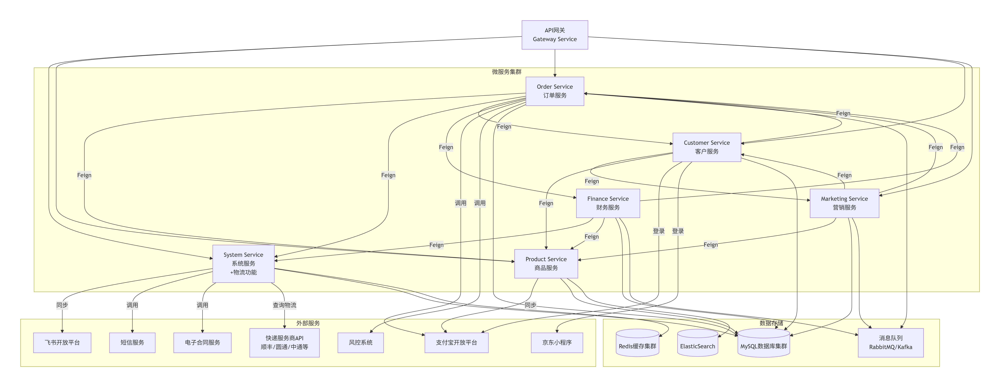

## 1. 开发规范

### 1.1 代码规范

#### 1.1.1 包结构规范

```
com.bajiezu.cloud.${service}
├── common                 # 公共模块
│   ├── constant          # 常量
│   ├── exception         # 异常
│   ├── util              # 工具类
│   ├── config            # 配置
│   └── domain            # 领域模型
├── system                # 服务名，如 system
│   ├── controller        # 控制器
│   ├── service           # 服务层
│   │   ├── impl         # 服务实现
│   │   └── feign        # Feign客户端
│   ├── mapper           # 数据访问层
│   └── entity           # 实体类
└── Application.java     # 启动类
```

```
├── 基础设施层 (阿里云)
│   ├── MSE (微服务引擎) - 服务发现与配置中心
│   ├── SLS (日志服务) - 日志收集与分析（打印到本地，服务器通过运维脚本上报到SLS）
│   ├── DB (MySQL) - 数据库（本地调试自己部署mysql， 测试和生产用阿里云的polarDB）
│   ├── Redis - 缓存(本地调试自己部署redis， 测试和生产用阿里云的redis)
│   ├── MQ (消息队列) - 异步消息处理
│   └── ACK (容器服务) - 容器编排
|   └── ARMS (应用实时监控) - 实时监控
|
├── 微服务层
│   ├── System Service (系统服务,sys)
│   ├── Product Service (商品服务, product)
│   ├── Order Service (订单服务, order)
│   ├── Customer Service (客户服务, customer)
│   ├── Finance Service (财务服务, finance)
│   └── Marketing Service (营销服务, marketing)
└── 外部服务
    ├── 飞书开放平台
    ├── 支付宝开放平台
    ├── 京东小程序
    ├── 短信服务
    └── 电子合同服务
    └── 物流服务
```

#### 1.1.2 接口响应规范

```java

@Data
public class CommonResult<T> implements Serializable {

  /**
   * 错误码
   *
   * @see ErrorCode#getCode()
   */
  private Integer code;
  /**
   * 错误提示，用户可阅读
   *
   * @see ErrorCode#getMsg() ()
   */
  private String msg;
  /**
   * 返回数据
   */
  private T data;

  /**
   * 请求唯一标识
   */
  private String requestId;

  @SneakyThrows
  private CommonResult() {
    this.requestId = RequestContext.getRequestId();
  }
}


// 使用示例
@RestController
@RequestMapping("/api/partner")
public class PartnerController {

  @GetMapping("/{id}")
  public CommonResult<PartnerDTO> getPartner(@PathVariable Long id) {
    PartnerDTO partner = partnerService.getById(id);
    return CommonResult.success(partner);
  }
}
```

### 1.2 数据库设计规范

每个微服务单独创建数据库，数据库命名规则为 `db_${service}`，如 `db_system`。

1**字段命名**: 使用小写字母和下划线，如 `partner_name`
2**主键**: 统一使用 `id bigint NOT NULL AUTO_INCREMENT`
3**时间字段**: 创建时间 `create_time`，更新时间 `updated_time`
4**软删除**: 使用 `delete_flag bigint DEFAULT 0` 表示删除状态

### 1.3 接口设计规范

#### 1.3.1 RESTful API设计

全部使用POST 方法。

#### 1.3.2 API版本控制

```
# 方案一：URL路径版本控制
/api/v1/partners
/api/v2/partners

# 方案二：请求头版本控制
Accept: application/vnd.rental.v1+json
```

## 2. 部署与运维

### 2.1 环境配置

| 环境       | 描述       | 配置                               |
|----------|----------|----------------------------------|
| **开发环境** | 开发人员本地开发 | 本地MySQL、Redis, 去STS申请个人namespace |
| **测试环境** | 集成测试环境   | 阿里云ECS + PolarDB + Redis         |
| **预发环境** | 生产环境预发布  | 与生产环境相同配置                        |
| **生产环境** | 线上正式环境   | 阿里云ACK + PolarDB + Redis集群       |

### 2.2 监控告警配置

#### 2.2.1 关键监控指标

1. **应用健康度**: 服务可用性、响应时间
2. **业务指标**: 订单量、支付成功率、库存变化
3. **系统指标**: CPU、内存、磁盘、网络
4. **中间件**: 数据库连接数、Redis命中率、MQ堆积

#### 2.2.2 告警规则配置

```yaml
# 告警规则示例
alerts:
  - alert: HighErrorRate
    expr: rate(http_requests_total{status=~"5.."}[5m]) > 0.1
    for: 5m
    labels:
      severity: critical
    annotations:
      summary: "高错误率告警"
      description: "{{ $labels.service }} 错误率超过10%"

  - alert: ServiceDown
    expr: up{job="system-service"} == 0
    for: 1m
    labels:
      severity: critical
    annotations:
      summary: "服务宕机告警"
      description: "{{ $labels.instance }} 服务已宕机"
```