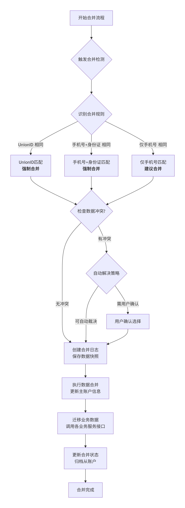

# 客户微服务详细设计说明书（V1.1）

## 1. 数据库设计

### 1.1 表结构设计

#### **customer (客户基础信息表)**

```sql
CREATE TABLE `customer`
(
    `id`              BIGINT(20)  NOT NULL COMMENT '客户ID（平台内部唯一ID）',
    `platform_uid`    VARCHAR(64) NOT NULL COMMENT '平台统一用户标识',
    `third_party_id`  VARCHAR(128)         DEFAULT NULL COMMENT '第三方平台用户ID',
    `platform_name`   VARCHAR(64) NOT NULL COMMENT '来源平台名称',
    `source_channel`  VARCHAR(32) NOT NULL COMMENT '来源渠道：AliPay, JD, WeChat',
    `mobile`          VARCHAR(64)          DEFAULT NULL COMMENT '手机号（加密存储）',
    `email`           VARCHAR(128)         DEFAULT NULL COMMENT '邮箱（加密存储）',
    `id_card`         VARCHAR(256)         DEFAULT NULL COMMENT '证件号（加密存储）',
    `id_card_hash`    VARCHAR(256)         DEFAULT NULL COMMENT '证件号hash（匹配用）',
    `nickname`        VARCHAR(100)         DEFAULT NULL COMMENT '昵称',
    `avatar_url`      VARCHAR(512)         DEFAULT NULL COMMENT '头像URL',
    `real_name`       VARCHAR(100)         DEFAULT NULL COMMENT '真实姓名（加密存储）',
    `gender`          TINYINT(1)           DEFAULT NULL COMMENT '性别：0-未知，1-男，2-女',
    `birthday`        DATE                 DEFAULT NULL COMMENT '生日',
    `area_code`       VARCHAR(50)          DEFAULT NULL COMMENT ' 归属地,精确到市的区划代码 ',
    `in_black_list`   TINYINT(1)           DEFAULT 0 COMMENT '是否进黑名单：0-否，1-是',
    `in_black_reason` text                 DEFAULT null COMMENT ' 进黑名单原因',
    `is_anonymous`    TINYINT(1)  NOT NULL DEFAULT ' 1 ' COMMENT ' 是否匿名：0-否，1-是 ',
    `account_status`  TINYINT(2)  NOT NULL DEFAULT ' 1 ' COMMENT ' 账户状态：0-禁用，1-正常，2-冻结，3-合并后归档 ',
    `merge_master_id` BIGINT(20)           DEFAULT NULL COMMENT ' 合并后的主账户ID ',
    `last_login_time` DATETIME             DEFAULT NULL COMMENT ' 最后登录时间 ',
    `last_login_ip`   VARCHAR(45)          DEFAULT NULL COMMENT ' 最后登录IP ',
    `version`         INT(11)     NOT NULL DEFAULT ' 0 ' COMMENT ' 版本号（乐观锁）',
    `create_by`       bigint               DEFAULT -1 COMMENT '标签创建者',
    `updated_by`      bigint               DEFAULT -1 COMMENT '标签更新者',
    `create_time`     DATETIME    NOT NULL DEFAULT CURRENT_TIMESTAMP COMMENT '创建时间',
    `update_time`     DATETIME    NOT NULL DEFAULT CURRENT_TIMESTAMP ON UPDATE CURRENT_TIMESTAMP COMMENT '更新时间',
    `is_deleted`      TINYINT(1)  NOT NULL DEFAULT '0' COMMENT '是否删除：0-否，1-是',
    PRIMARY KEY (`id`),
    UNIQUE KEY `uk_platform_uid` (`platform_uid`),
    UNIQUE KEY `uk_third_party_source` (`third_party_id`, `source_channel`),
    KEY `idx_mobile` (`mobile`),
    KEY `idx_id_card_hash` (`id_card_hash`),
    KEY `idx_merge_master` (`merge_master_id`),
    KEY `idx_create_time` (`create_time`),
    KEY `idx_status_source` (`account_status`, `source_channel`)
) ENGINE = InnoDB
  DEFAULT CHARSET = utf8mb4 COMMENT =' 客户基础信息表 ';
```

#### **customer_log (客户日志)**

```sql
CREATE TABLE `customer_log`
(
    `id`           BIGINT(20) NOT NULL COMMENT '主键',
    `customer_id`  BIGINT(64) NOT NULL COMMENT '客户ID',
    `operate_type` VARCHAR(128)        DEFAULT NULL COMMENT '操作 类型',
    `operator_id`  BIGINT(64) NOT NULL COMMENT '操作人',
    `action_desc`  TEXT COMMENT '操作描述',
    `create_by`    bigint              DEFAULT -1 COMMENT '创建者',
    `updated_by`   bigint              DEFAULT -1 COMMENT '更新者',
    `create_time`  DATETIME   NOT NULL DEFAULT CURRENT_TIMESTAMP COMMENT '创建时间',
    `update_time`  DATETIME   NOT NULL DEFAULT CURRENT_TIMESTAMP ON UPDATE CURRENT_TIMESTAMP COMMENT '更新时间',
    `is_deleted`   TINYINT(1) NOT NULL DEFAULT '0' COMMENT '是否删除：0-否，1-是',
    PRIMARY KEY (`id`),
    KEY `idx_create_time` (`create_time`),
    KEY `idx_customer_operate` (`customer_id`, `operate_type`)
) ENGINE = InnoDB
  DEFAULT CHARSET = utf8mb4 COMMENT =' 客户操作日志表，主要记录B端操作，如编辑、进黑名单等操作 ';
```

#### **customer_ext (客户扩展信息表)**

```sql
CREATE TABLE `customer_ext`
(
    `id`          BIGINT(20)   NOT NULL AUTO_INCREMENT COMMENT '主键ID',
    `customer_id` BIGINT(20)   NOT NULL COMMENT '客户ID',
    `ext_type`    VARCHAR(32)  NOT NULL COMMENT '扩展类型：AlipayInfo, JDInfo, WechatInfo, BaseExt',
    `ext_key`     VARCHAR(100) NOT NULL COMMENT '扩展字段Key',
    `ext_value`   TEXT COMMENT '扩展字段Value（JSON格式存储）',
    `source_from` VARCHAR(32)  NOT NULL COMMENT '数据来源：System, Alipay, JD, Wechat, Manual',
    `is_valid`    TINYINT(1)   NOT NULL DEFAULT '1' COMMENT '是否有效：0-否，1-是',
    `create_by`   bigint                DEFAULT -1 COMMENT '标签创建者',
    `updated_by`  bigint                DEFAULT -1 COMMENT '标签更新者',
    `create_time` DATETIME     NOT NULL DEFAULT CURRENT_TIMESTAMP COMMENT '创建时间',
    `update_time` DATETIME     NOT NULL DEFAULT CURRENT_TIMESTAMP ON UPDATE CURRENT_TIMESTAMP COMMENT '更新时间',
    `is_deleted`  TINYINT(1)   NOT NULL DEFAULT '0' COMMENT '是否删除：0-否，1-是',
    PRIMARY KEY (`id`),
    UNIQUE KEY `uk_customer_ext_type_key` (`customer_id`, `ext_type`, `ext_key`),
    KEY `idx_customer_id` (`customer_id`),
    KEY `idx_ext_type` (`ext_type`),
    KEY `idx_ext_key` (`ext_key`)
) ENGINE = InnoDB
  DEFAULT CHARSET = utf8mb4 COMMENT ='客户扩展信息表';
```

**扩展信息表数据示例：**

```json
[
  {
    "customer_id": 10001,
    "ext_type": "AlipayInfo",
    "ext_key": "alipay_user_info",
    "ext_value": "{\"user_id\":\"2088xxxxxx\",\"user_status\":\"T\",\"user_type\":\"2\",\"is_certified\":\"T\",\"is_student_certified\":\"F\",\"certified_level\":\"L3\"}",
    "source_from": "Alipay"
  },
  {
    "customer_id": 10001,
    "ext_type": "BaseExt",
    "ext_key": "occupation",
    "ext_value": "\"互联网/IT\"",
    "source_from": "Manual"
  }
]
```

#### **customer_address (客户地址表)**

```sql
CREATE TABLE `customer_address`
(
    `id`              BIGINT(20)   NOT NULL AUTO_INCREMENT COMMENT '地址ID',
    `customer_id`     BIGINT(20)   NOT NULL COMMENT '客户ID',
    `address_type`    TINYINT(2)   NOT NULL DEFAULT '1' COMMENT '地址类型：1-家庭，2-公司，3-学校，4-其他',
    `receiver_name`   VARCHAR(100) NOT NULL COMMENT '收货人姓名',
    `receiver_mobile` VARCHAR(64)  NOT NULL COMMENT '收货人手机号（加密存储）',
    `area_code`       VARCHAR(20)  NOT NULL COMMENT '选中的区县代码，关联地址表的code字段',
    `street_address`  VARCHAR(500) NOT NULL COMMENT '详细街道地址',
    `postal_code`     VARCHAR(20)           DEFAULT NULL COMMENT '邮政编码',
    `is_default`      TINYINT(1)   NOT NULL DEFAULT '0' COMMENT '是否默认地址：0-否，1-是',
    `create_by`       bigint                DEFAULT -1 COMMENT '标签创建者',
    `updated_by`      bigint                DEFAULT -1 COMMENT '标签更新者',
    `create_time`     DATETIME     NOT NULL DEFAULT CURRENT_TIMESTAMP COMMENT '创建时间',
    `update_time`     DATETIME     NOT NULL DEFAULT CURRENT_TIMESTAMP ON UPDATE CURRENT_TIMESTAMP COMMENT '更新时间',
    `is_deleted`      TINYINT(1)   NOT NULL DEFAULT '0' COMMENT '是否删除：0-否，1-是',
    PRIMARY KEY (`id`),
    KEY `idx_customer_id` (`customer_id`, `is_deleted`),
    KEY `idx_customer_default` (`customer_id`, `is_default`),
    KEY `idx_mobile_hash` ((MD5(`receiver_mobile`)))
) ENGINE = InnoDB
  DEFAULT CHARSET = utf8mb4 COMMENT ='客户地址表';
```

#### **merge_log (用户合并日志表)**

```sql
CREATE TABLE `merge_log`
(
    `merge_id`                 BIGINT(20)  NOT NULL AUTO_INCREMENT COMMENT '合并ID',
    `merge_type`               TINYINT(2)  NOT NULL COMMENT '合并类型：1-自动合并，2-用户手动合并，3-管理员合并',
    `merge_rule`               VARCHAR(50) NOT NULL COMMENT '合并规则：MobileMatch, IDCardMatch, ThirdPartyMatch',
    `master_customer_id`       BIGINT(20)  NOT NULL COMMENT '主账户ID',
    `slave_customer_ids`       JSON        NOT NULL COMMENT '从账户ID列表',
    `merge_status`             TINYINT(2)  NOT NULL DEFAULT '1' COMMENT '合并状态：1-进行中，2-成功，3-失败，4-已回滚',
    `merge_before_snapshot`    JSON COMMENT '合并前数据快照',
    `merge_after_snapshot`     JSON COMMENT '合并后数据快照',
    `business_transfer_result` JSON COMMENT '业务数据迁移结果',
    `operator_id`              BIGINT(20)           DEFAULT NULL COMMENT '操作人ID（用户或管理员）',
    `operator_type`            VARCHAR(20)          DEFAULT NULL COMMENT '操作人类型：System, User, Admin',
    `merge_remark`             VARCHAR(500)         DEFAULT NULL COMMENT '合并备注',
    `rollback_reason`          VARCHAR(500)         DEFAULT NULL COMMENT '回滚原因',
    `create_by`                bigint               DEFAULT -1 COMMENT '标签创建者',
    `updated_by`               bigint               DEFAULT -1 COMMENT '标签更新者',
    `create_time`              DATETIME    NOT NULL DEFAULT CURRENT_TIMESTAMP COMMENT '创建时间',
    `update_time`              DATETIME    NOT NULL DEFAULT CURRENT_TIMESTAMP ON UPDATE CURRENT_TIMESTAMP COMMENT '更新时间',
    `is_deleted`               TINYINT(1)  NOT NULL DEFAULT '0' COMMENT '是否删除：0-否，1-是',
    PRIMARY KEY (`merge_id`),
    KEY `idx_master_customer` (`master_customer_id`),
    KEY `idx_merge_time` (`create_time`),
    KEY `idx_merge_status` (`merge_status`),
    KEY `idx_merge_rule` (`merge_rule`)
) ENGINE = InnoDB
  DEFAULT CHARSET = utf8mb4 COMMENT ='用户合并日志表';
```

#### **customer_label_info (客户标签表（客户和标签关联关系）)**

```sql
CREATE TABLE `customer_label_info`
(
    `id`          BIGINT(20) NOT NULL AUTO_INCREMENT COMMENT '主键ID',
    `customer_id` BIGINT(20) NOT NULL COMMENT '客户ID',
    `label_id`    BIGINT(20) NOT NULL COMMENT '标签ID',
    `create_by`   bigint              DEFAULT -1 COMMENT '标签创建者',
    `updated_by`  bigint              DEFAULT -1 COMMENT '标签更新者',
    `create_time` DATETIME   NOT NULL DEFAULT CURRENT_TIMESTAMP COMMENT '创建时间',
    `update_time` DATETIME   NOT NULL DEFAULT CURRENT_TIMESTAMP ON UPDATE CURRENT_TIMESTAMP COMMENT '更新时间',
    `is_deleted`  TINYINT(1) NOT NULL DEFAULT '0' COMMENT '是否删除：0-否，1-是',
    PRIMARY KEY (`id`),
    UNIQUE KEY `uk_customer_labelk` (`customer_id`, `label_id`)
) ENGINE = InnoDB
  DEFAULT CHARSET = utf8mb4 COMMENT ='客户标签表（客户和标签关联关系）';
```

#### **label_info (客户标签表)**

```sql
CREATE TABLE `label_info`
(
    `id`           BIGINT(20)   NOT NULL AUTO_INCREMENT COMMENT '主键ID',
    `name`         VARCHAR(50)  NOT NULL COMMENT '标签名称',
    `description`  VARCHAR(100) NOT NULL COMMENT '标签描述',
    `label_type`   tinyint(2)   NOT NULL DEFAULT 1 COMMENT '标签类型，如：1-手动添加',
    `label_status` tinyint(1)   NOT NULL DEFAULT 1 COMMENT '标签状态：1-启用，0-禁用',
    `create_by`    bigint                DEFAULT -1 COMMENT '标签创建者',
    `updated_by`   bigint                DEFAULT -1 COMMENT '标签更新者',
    `create_time`  DATETIME     NOT NULL DEFAULT CURRENT_TIMESTAMP COMMENT '创建时间',
    `update_time`  DATETIME     NOT NULL DEFAULT CURRENT_TIMESTAMP ON UPDATE CURRENT_TIMESTAMP COMMENT '更新时间',
    `is_deleted`   TINYINT(1)   NOT NULL DEFAULT '0' COMMENT '是否删除：0-否，1-是',
    PRIMARY KEY (`id`),
    UNIQUE KEY `uk_name` (`name`)
) ENGINE = InnoDB
  DEFAULT CHARSET = utf8mb4 COMMENT ='标签信息表';
```

#### **customer_risk_result (客户标签日志表，后续使用)**

```sql
CREATE TABLE `customer_risk_result`
(
    `id`               BIGINT(20)  NOT NULL AUTO_INCREMENT COMMENT '主键ID',
    `customer_id`      BIGINT(20)  NOT NULL COMMENT '客户ID',
    `risk_event_id`    VARCHAR(64) NOT NULL COMMENT '风控事件ID（全局唯一，用于幂等）',
    `risk_scene`       VARCHAR(50) NOT NULL COMMENT '风控场景：LOGIN, ORDER, PAYMENT, WITHDRAW, ACTIVITY',
    `risk_level`       TINYINT(2)  NOT NULL COMMENT '风险等级：1-低风险，2-中风险，3-高风险',
    `risk_score`       INT(11)              DEFAULT NULL COMMENT '风险评分（0-1000分，越高越风险）',
    `credit_score`     INT(11)              DEFAULT NULL COMMENT '信用评分',
    `risk_tags`        JSON                 DEFAULT NULL COMMENT '风险标签数组：["新设备", "异地登录", "高频尝试"]',
    `risk_detail`      JSON        NOT NULL COMMENT '完整风控结果详情（原始响应或关键指标）',
    `request_context`  JSON                 DEFAULT NULL COMMENT '触发风控的请求上下文（IP、设备、行为等）',
    `decision_action`  VARCHAR(50)          DEFAULT NULL COMMENT '风控处置建议：PASS, REVIEW, REJECT, CHALLENGE',
    `is_manual_review` TINYINT(1)           DEFAULT '0' COMMENT '是否触发人工审核：0-否，1-是',
    `review_status`    TINYINT(2)           DEFAULT NULL COMMENT '人工审核状态：1-待审核，2-审核通过，3-审核拒绝',
    `expire_time`      DATETIME             DEFAULT NULL COMMENT '风险结果过期时间（用于临时风险）',
    `create_by`        bigint               DEFAULT -1 COMMENT '标签创建者',
    `updated_by`       bigint               DEFAULT -1 COMMENT '标签更新者',
    `create_time`      DATETIME    NOT NULL DEFAULT CURRENT_TIMESTAMP COMMENT '创建时间',
    `update_time`      DATETIME    NOT NULL DEFAULT CURRENT_TIMESTAMP ON UPDATE CURRENT_TIMESTAMP COMMENT '更新时间',
    `is_deleted`       TINYINT(1)  NOT NULL DEFAULT '0' COMMENT '是否删除：0-否，1-是',
    PRIMARY KEY (`id`),
    UNIQUE KEY `uk_risk_event_id` (`risk_event_id`),
    KEY `idx_customer_id_scene_time` (`customer_id`, `risk_scene`, `create_time`),
    KEY `idx_customer_risk_level` (`customer_id`, `risk_level`),
    KEY `idx_create_time` (`create_time`),
    KEY `idx_for_tag_refresh` (`customer_id`, `create_time`) COMMENT '为标签刷新任务优化'
) ENGINE = InnoDB
  DEFAULT CHARSET = utf8mb4 COMMENT ='客户风控结果记录表';
```

## 2. 用户合并流程图

### 2.1 用户合并流程图



## 3. 关键设计说明

### 3.1 客户ID生成策略

- **platform_uid**：平台统一用户标识，格式：`CUS${时间戳}${6位随机数}`，在用户首次创建时生成，终身不变
- **customer_id**：数据库主键，使用分布式ID生成器（如雪花算法），用于系统内部关联
- **third_party_id**：第三方平台用户ID，如支付宝的`open_id`、`user_id`，京东的`pin`等

### 3.2 扩展信息表设计优势

1. **灵活性**：无需频繁修改表结构即可添加新字段
2. **多源数据存储**：可同时存储来自不同渠道的用户信息
3. **版本化管理**：通过时间戳可追溯用户信息的变更历史
4. **查询优化**：对常用查询字段可在基础表中冗余，不常用字段放扩展表

### 3.3 用户合并实现细节

1. **合并原子性**：合并操作需要在事务中执行，保证数据一致性
2. **异步业务迁移**：业务数据迁移可异步执行，提高合并响应速度
3. **回滚机制**：通过合并日志中的快照数据，支持合并操作的回滚
4. **冲突预警**：对于高风险合并（如双方都有大额资产），需要人工审核

### 3.4 数据安全设计

1. **敏感信息加密**：手机号、邮箱、证件号等使用AES加密存储
2. **脱敏显示**：对外接口返回脱敏后的信息，如手机号显示为`138****5678`
3. **访问日志**：记录所有敏感数据的访问记录，便于审计
4. **数据权限**：根据操作人角色控制数据访问范围

## 4. 对外接口模块

- **Feign Client接口（对内）**:
    - `CustomerClient#getCustomerById(Long customerId)`: 获取客户脱敏后信息。
    - `CustomerClient#checkAndGetCustomer(String mobile)`: 风控或营销场景下校验并获取客户。
    - `CustomerClient#checkRisk(String checkContent)`: 调用风控结果接口。
    - `CustomerClient#mergeCustomer(MergeRequest request)`: 内部业务触发用户合并（需权限）。
- **C端REST API（对外）**:
    - `POST /api/customer/login`: 小程序登录。
    - `POST /api/customer/update`: 用户基本信息维护（昵称修改，头像信息等修改）。
    - `GET /api/customer/profile`: 获取当前用户详情。
    - `POST /api/customer/bind-mobile`: 绑定手机号（可能触发合并）。
    - `POST /api/customer/addresses`: 新增地址。
    - `POST /api/customer/merge/confirm`: 确认执行合并建议。

